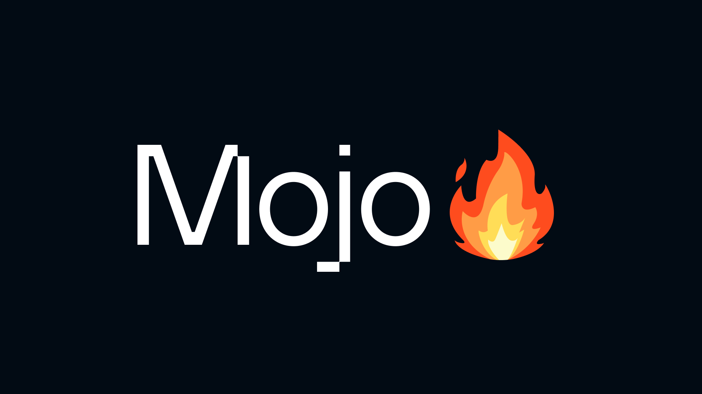

# 🌟 MOJO Programming for AI Development 🌟

   
   

  
  
  
<!--  -->
 

Welcome to the **MOJO Programming for AI Development** course! This course is designed to help you dive deep into the MOJO programming language, focusing on its features and performance, especially in the context of AI development. Each day covers different aspects of the language, from basic syntax to advanced AI applications.

## 📚 Table of Contents

- [🌟 MOJO Programming for AI Development 🌟](#-mojo-programming-for-ai-development-)
  - [📚 Table of Contents](#-table-of-contents)
  - [Day 1: Variables, Declarations, Syntax, Data Types, and Conditional Statements](#day-1-variables-declarations-syntax-data-types-and-conditional-statements)
  - [Day 2: Functions, Argument Conventions, Data Collections, Methods, Constructors, and Method Overloading](#day-2-functions-argument-conventions-data-collections-methods-constructors-and-method-overloading)
  - [Day 3: Metaprogramming, Modules, Packages, and Interoperability with Python](#day-3-metaprogramming-modules-packages-and-interoperability-with-python)
  - [Day 4: Mojo vs Python Performance, AI Use Cases with Mojo Programming](#day-4-mojo-vs-python-performance-ai-use-cases-with-mojo-programming)
  - [Day 5: Final Day Assignment](#day-5-final-day-assignment)
    - [Assignment Tasks](#assignment-tasks)
  - [Online Compiler for MOJO](#online-compiler-for-mojo)
    - [MOJO Playground - official online compiler](#mojo-playground---official-online-compiler)
  - [⭐ Getting Started](#-getting-started)
  - [How to Contribute](#how-to-contribute)
  - [📖 Additional Resources](#-additional-resources)

---

## Day 1: Variables, Declarations, Syntax, Data Types, and Conditional Statements

- **Topics Covered:**
  - 📜 Basic syntax and structure of MOJO
  - 📝 Variable declarations and data types
  - 🔄 Conditional statements and control flow

---

## Day 2: Functions, Argument Conventions, Data Collections, Methods, Constructors, and Method Overloading

- **Topics Covered:**
  - 🔧 Defining functions and understanding `Inout`, `Borrowed`, and `Owned` argument conventions
  - 📦 Handling data collections effectively
  - 🔍 Methods, constructors, and method overloading

---

## Day 3: Metaprogramming, Modules, Packages, and Interoperability with Python

- **Topics Covered:**
  - 🛠️ Introduction to metaprogramming: decorators and parameterization
  - 📚 Creating and using MOJO modules and packages
  - 🔗 Interoperability of MOJO with the Python ecosystem

---

## Day 4: Mojo vs Python Performance, AI Use Cases with Mojo Programming

- **Topics Covered:**
  - ⚖️ Performance comparison between MOJO and Python
  - 🤖 Exploring AI use cases with MOJO Programming

---

## Day 5: Final Day Assignment

### Assignment Tasks

1. **Performance Optimization Task:**
   - 📅 Generate a calendar from 2010 to 2030 using MOJO. Optimize the code with vectorization, parallelization, and performance enhancements.

2. **AI Model Implementation Task:**
   - 🧠 Implement a multi-layer perceptron model in MOJO with:
     - Three input nodes
     - At least three nodes in the hidden layer
     - Purpose: Implement universal logical gates

---

## Online Compiler for MOJO
### [MOJO Playground - official online compiler](https://docs.modular.com/mojo/playground)

 

## ⭐ Getting Started

To get started with MOJO, follow these steps:

1. **Install MOJO:**
   - Visit the [MOJO Installation Guide](https://docs.modular.com/max/install) for detailed instructions on how to install MOJO on your system.

2. **Explore the Documentation:**
   - Familiarize yourself with the [MOJO Language Documentation](https://docs.modular.com/mojo/manual/) to understand the language's syntax, features, and capabilities.

3. **Join the Community:**
   - Connect with other MOJO enthusiasts on the [MOJO Community Forum](https://community.mojo.so/) to share knowledge, ask questions, and collaborate on projects.

---

 

## How to Contribute

We welcome contributions from the community! To contribute to this course or the MOJO language, follow these steps:

1. **Fork the Repository:**
   - Fork the project repository to your GitHub account.

3. **Clone the Repository:**
   - Clone the forked repository to your local machine using `git clone`.
  
   - `
   git clone https://github.com/Lakshya-GG/Mojo-Programming-language-for-all-of-AI.git
   `

4. **Create a Branch:**
   - Create a new branch for your feature or bugfix.
   - `git checkout -b feature/your-feature`

5. **Make Changes:**
   - Implement your changes and commit them with clear and concise commit messages.
   - `git commit -am 'Add some feature'`

6. **Push Changes:**
   - Push your changes to your forked repository.
   -  `git push origin feature/your-feature`

7. **Create a Pull Request:**
   - Submit a pull request to the main repository with a description of your changes.

---

## 📖 Additional Resources

- **Documentation and Tutorials:** [MOJO Language Documentation](https://docs.modular.com/mojo/manual/)
- **MOJO Community and Support:** [MOJO Community Forum](https://community.mojolang.org)

---

Happy coding and exploring the power of MOJO programming! 🚀
